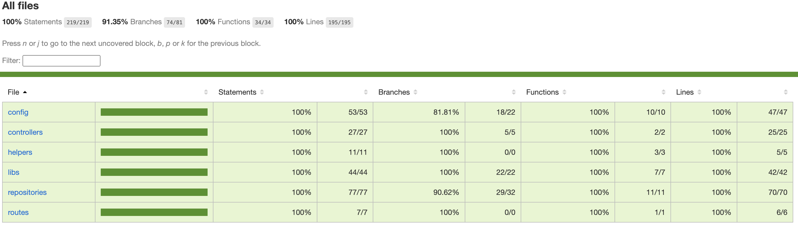

# Trading API

ThiS API connects with [Bitfinex API](https://docs.bitfinex.com/reference/ws-public-books). It's usefull for getting the bid-ask list, the effective price if a order is executed and the marketdepth based on the orderbook snapshot for a given pair name.

## Installation

1. Clone the repository.
2. Run `cp .env.example .env`.
3. Run `npm i`.
4. Run `npm run start:watch` for running in dev mode.
5. The server will be available at `localhost:3000`.

## scripts

1. Run `npm run build` for generating a prod build.
2. Run `npm run eslint` for running eslint.
3. Run `npm run test` for running tests.
4. Run `npm run test <test name>` for running a specific test.

## Endpoints

`GET <host>/api/order/:pairName`

Response:

```
{
    "bids": [
        {
            "price": 1534.7,
            "count": 6,
            "amount": 3.325
        },
        ...
    ],
     "asks": [
        {
             "price": 1535.1,
            "count": 1,
            "amount": -1.6288315
        },
        ...
    ]
}
```

`POST <host>/api/order`

Payload:
```
{
    "name": "tETHUSD", // pair name
    "operation": "sell", // type of operation
    "amount": "5", // the desire amount to buy
    "priceLimit": 7000 // the max price you are able to pay
}
```

Response:

```
{
    "depth": "0.16%",
    "totalPrice": "6738.50",
    "totalCount": 5
}
```
Note: if `priceLimit` is specified then it will return the max price and size you will be able to buy for a given price limit.

## Coverage

100% coverage

